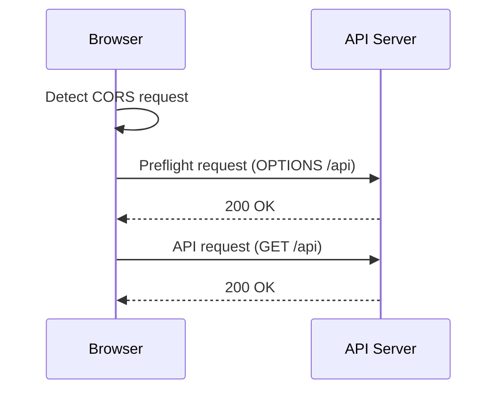

# はじめに
CORS(Cross-origin Resource Shareing)について、「異なるオリジン間でやりとりするときに考えないといけないやつだなあ」というふんわりした理解しか持てていなかったので、ちゃんと調べて理解を深めるための記事です。

# CORSとは
CORSとは異なるオリジン間でリソースを共有する際の取り決めのことです。異なるオリジンというのは、例えば https://hoge.com -> https://fuga.com にリクエストを送ることを指します。


https://hoge.com も https://fuga.com もともに信頼できる安全なサイトであれば問題ないですが、どちらかが悪意のあるサイトである可能性もあります。hogeからfugaにPOSTリクエストでデータを送信したが、実はfugaは悪意のあるサイトでhogeのデータが不正利用されてしまうかもしれません。


こうした事態を未然に防ぐため、ブラウザは異なるオリジンへのリクエストを原則禁止しています。異なるオリジンへリクエストを送信したい場合はサーバー側で「CORSを許可します」ということを明示的に設定して示す必要があります。

# CORSエラーの例
例えばブラウザからAPI Gatewayにリクエストを送信する事を考えます。


まずAPI Gatewayで以下のようなエンドポイントを作成します。


ブラウザ側で以下のソースを実装します。

```html
<!DOCTYPE html>
<html lang="en">

<head>
    <meta charset="UTF-8">
    <meta name="viewport" content="width=device-width, initial-scale=1.0">
    <title>Hello cors-test</title>
</head>

<body>
    <h2>cors-test</h2>
</body>
<script>
    const url = 'https://xxxxxxxxx.execute-api.ap-northeast-1.amazonaws.com/prod/';

    fetch(url, {
            method: 'GET',
            headers: {
                'Content-Type': 'application/json',
            },
        })
        .then(response => {
            console.log('Response Headers:', [...response.headers.entries()]);
            if (!response.ok) {
                throw new Error(`HTTP error! status: ${response.status}`);
            }
            return response.json();
        })
        .then(data => {
            console.log('Response:', data);
        })
        .catch(error => {
            console.error('Error:', error.message);
        });
</script>

</html>
```
`https://xxxxxxxxx.execute-api.ap-northeast-1.amazonaws.com/prod/`はAPI Gatewayのエンドポイントです。API Gatewayの先にはLambda関数があります。

このソースをブラウザで実行すると下記のエラーになります。


ブラウザの開発者ツールからネットワークタブを確認すると、prod/から`CORS error`と`403`が帰ってきていました。


API Gatewayには`CORSを許可する`というボタンが右上に表示されているので、ここからCORSを有効にすることができます。


各設定項目の意味は後述します。`Access-Control-Allow-Methods`でリクエストしたいメソッドにチェックを入れて保存すればOKです。


CORS有効化したのちに再度ブラウザからAPI Gatewayにアクセスすると、無事200 OKが返ってくることを確認できました。


# CORSリクエストのフロー
CORSリクエストがサーバーで処理される様子をシーケンス図に表しました。


ブラウザがCORSリクエストを検知するとプリフライトリクエスト(Prefilight request)というリクエストをサーバーに送信します。プリフライトリクエストの詳細については後述します。

プリフライトリクエストが200レスポンスを返したのち、本来送信したかったAPIへのリクエストを送信します。

### プリフライトリクエスト / Preflight request
CORSリクエストをブラウザが検知したタイミングで、ブラウザはAPIへのリクエスト送信の前にプリフライトリクエストというリクエストを送信します。プリフライトリクエストは送信先のサーバーがCORSに対応しているかをチェックするためのリクエストです。

```:request
OPTIONS /api
Access-Control-Request-Method: GET
Access-Control-Request-Headers: content-type
Origin: https://hoge.com
```

```:response
Request Method: OPTIONS
Status Code: 200 OK
Referrer Policy: strict-origin-when-cross-origin

access-control-allow-headers: Content-Type,X-Amz-Date,Authorization,X-Api-Key,X-Amz-Security-Token
access-control-allow-methods: GET,OPTIONS
access-control-allow-origin: *
content-length: 0
content-type: application/json
date: Tue, 26 Nov 2024 23:21:11 GMT
x-amz-apigw-id: xxxxxxx
x-amzn-requestid: xxxxxxxxx
```
`access-control-allow-*`のレスポンスヘッダーはAPI GatewayでCORSを有効化したときに指定した値たちになります。

https://developer.mozilla.org/ja/docs/Glossary/Preflight_request

### CORSヘッダー
プリフライトリクエストのレスポンスには`Access-Control-`で始まるレスポンスヘッダーが付与されています。それぞれ下記の意味を持ちます。

- Access-Control-Allow-Origin
    - 許可するオリジンを指定
    - `*`を指定するとすべてのオリジンからのリクエストを許可する
- Access-Control-Allow-Methods
    - 許可するHTTPメソッドを指定
- Access-Control-Allow-Headers
    - 許可するカスタムヘッダーを指定


# 最後に
以上がCORSの内容になります。
