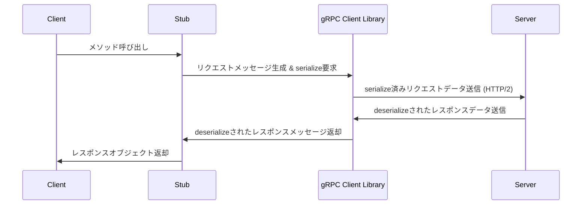

# はじめに
なんとなくしか理解できていなかったgRPCについて、自分なりに調べた結果を整理して記事にしました。gRPCの基本的な概念からユースケースまで、網羅的に理解を深めていただけると嬉しいです。

# gRPCとは
Googleが開発しているオープンソースのRPCフレームワークです。

https://github.com/grpc

### RPCとは
Remote Procedure Call（遠隔手続き呼び出し）です。ローカルマシンから別のリモートマシンに対してネットワークを介して処理を呼び出すことを指します。リモートマシンの処理をローカルマシンで実行しているかのように見せることができます。

# gRPCの特徴
### Protocol Buffers
クライアント/サーバー間のデータ受け渡しにはProtocol Buffersというserializeされたバイナリを利用します。.protoという拡張子で表され、Human Readableにするためにはdeserializeするロジックの実装が必要です。`protoc`というコンパイラを使ってProtocol Buffersをさまざまなプログラミング言語に変換することが可能です。

### HTTP/2
通信にはHTTP/2を利用することで高効率な通信を実現しています。例えば、HTTP/2では双方向ストリーミングによりクライアントとサーバーが同時にデータの送受信を行うことが可能です。（リクエストの送信中にレスポンスを受け取る、などができる）

# gRPCの処理フロー


- Client：処理を実行したいクライアント
- Stub：リモートサーバーの処理をローカルで実行しているように見せるためのスタブ
- gRPC Client Library：gRPCの通信に必要な処理を担当する（HTTP/2通信、serialize/deserializeなど）
- Server：リモートサーバー

# 実装例

引用：https://github.com/grpc/grpc/blob/master/examples/python/helloworld/greeter_server.py
```py:server
class Greeter(helloworld_pb2_grpc.GreeterServicer):
    def SayHello(self, request, context):
        return helloworld_pb2.HelloReply(message="Hello, %s!" % request.name)

def serve():
    port = "50051"
    server = grpc.server(futures.ThreadPoolExecutor(max_workers=10))
    helloworld_pb2_grpc.add_GreeterServicer_to_server(Greeter(), server)
    server.add_insecure_port("[::]:" + port)
    server.start()
    print("Server started, listening on " + port)
    server.wait_for_termination()


if __name__ == "__main__":
    logging.basicConfig()
    serve()
```

引用：https://github.com/grpc/grpc/blob/master/examples/python/helloworld/greeter_client.py
```py:client
def run():
    # NOTE(gRPC Python Team): .close() is possible on a channel and should be
    # used in circumstances in which the with statement does not fit the needs
    # of the code.
    print("Will try to greet world ...")
    with grpc.insecure_channel("localhost:50051") as channel:
        stub = helloworld_pb2_grpc.GreeterStub(channel)
        response = stub.SayHello(helloworld_pb2.HelloRequest(name="you"))
        print("Greeter client received: " + response.message)


if __name__ == "__main__":
    logging.basicConfig()
    run()
```

# gRPC vs REST APIの比較
gRPCとよく比較されるものとしてREST APIがあります。
| 観点| gRPC| REST|
| :------------- | :----------------------------------------- | :----------------------------------------------------------- |
| **通信プロトコル** | HTTP/2| HTTP/1.1 または HTTP/2|
| **データフォーマット** | Protocol Buffers | JSON（が一般的） |
| **ステータスコード** | gRPC独自のステータスコード。<br>例: `OK`, `CANCELLED`, `UNAVAILABLE`, `NOT_FOUND`など。<br>https://github.com/grpc/grpc/blob/master/examples/protos/helloworld.proto | HTTPステータスコード。<br>例: `200 OK`, `404 Not Found`, `500 Internal Server Error`など。 |
| **ユースケース** | - マイクロサービス間の高速な内部通信<br>- リアルタイム通信 (ストリーミング)<br>- 厳密なスキーマ定義が必要な場合<br>- 多言語環境でのサービス連携<br>- IoTデバイスとの通信 | - Web API (フロントエンドとバックエンドの通信)<br>- 公開API<br>- サーバー間の疎結合な連携<br>- キャッシュが必要な場合<br>- シンプルなリソース操作 |

### Protocol BuffersはJSONと比べてなぜ高速なのか？
Protocol Buffersはバイナリデータを扱うため高速な通信パフォーマンスを出すことができます。

Protocol Buffersはバイナリデータであり、JSONはテキストデータです。バイナリデータの方がデータの方が圧縮率が高いためデータがコンパクトになります。例えば`255`というデータを2進数で表すと11111111(2)なので1 byte(=8 bit)ですが、テキストで"255"とした場合は3 byteになります。その結果、バイナリデータの方が通信のパフォーマンスが良くなります。

### gRPCが独自のステータスコードを採用している理由
gRPCはメソッド指向のフレームワークであり、HTTPステータスコードが示すリソース指向のステータスとはセマンティクスが異なるためです。例えば、HTTPレベルでは`200 OK`と見なされても、gRPCのメソッドレベルのステータスコードでは`INVALID_ARGUMENT`や`UNAVAILABLE`となることがあります。

# RESTよりもgRPCを使いたくなるシーン
1. 低レイテンシな通信が求められるケース
    - 例：マイクロサービス間の通信
2. リアルタイム通信が求められるケース
    - HTTP/2の双方向スリーミングを用いたリアルタイム通信
    - 例：プッシュ通知
3. リソースが限定されているケース
    - バッテリー消費を抑えたいモバイルアプリケーションや、帯域幅の限られたIoTデバイスなどの機器間で通信を行う場合

# まとめ
gRPCは、Googleが開発した高性能なRPCフレームワークであり、Protocol Buffersによる効率的なデータシリアライズとHTTP/2による高速な通信が特徴です。REST APIと比較して、低レイテンシな通信、リアルタイム通信、リソースが限定された環境での利用に特に強みを発揮します。

この記事を通して、gRPCの理解が深まり、適切な場面で活用できるようになれば幸いです。

# 参考

https://grpc.io/docs/what-is-grpc/introduction/

https://grpc.io/docs/languages/python/quickstart/

https://qiita.com/S4nTo/items/0ff0445542538ef49a05

https://zenn.dev/sbk0716/books/cc9250158befd1
