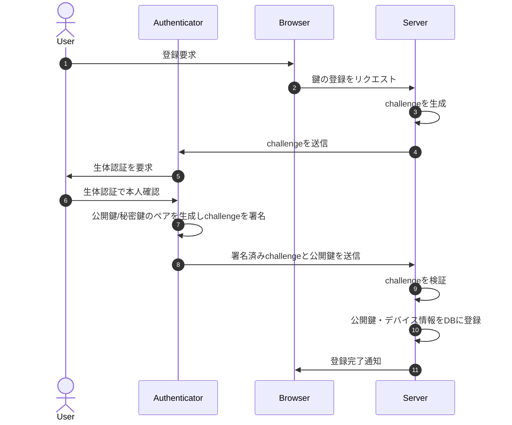
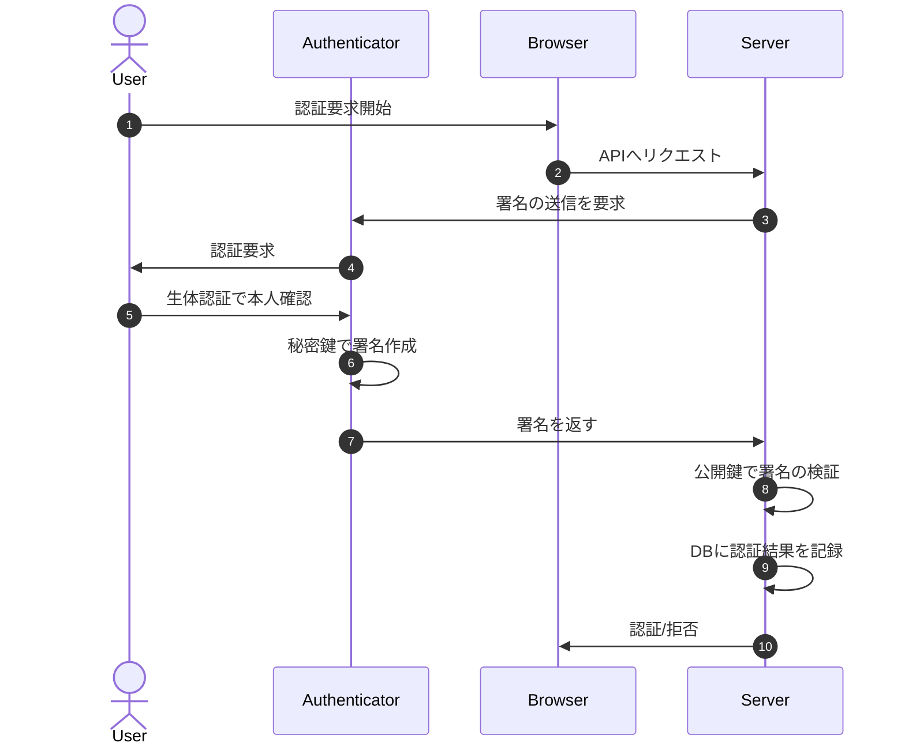

# はじめに
AWS Amplify(以下Amplifyと呼ぶ)で作ったWebアプリケーションにパスキー認証を導入した際の作業ログです。
個人で開発しているAmplify製のWebアプリにパスキー認証機能を導入したいなと思い、色々調べた結果を本記事にまとめました。（「Amplify × パスキー認証」に関する情報はググってもあまりHITしなかったので、記事にしておこうと思った次第です。）
使用してるフレームワークやライブラリのバージョンは執筆時点でのlatestもしくはstableなバージョンを採用しています。参考にされる場合はその点ご留意ください。

# サンプルアプリケーションの解説
↓本記事用に作ったサンプルアプリケーションがあるので、これをベースに解説していきます。

https://github.com/tttol/amplify-passwordless-auth/tree/main

このサンプルは、[aws-samples/amazon-cognito-passwordless-auth](https://github.com/aws-samples/amazon-cognito-passwordless-auth/tree/main)というAWSが公式に配布しているサンプルの中にある[end-to-end example](https://github.com/aws-samples/amazon-cognito-passwordless-auth/tree/main/end-to-end-example)というReactのサンプルアプリケーションを参考に作ったものとなります。

:::note warn
[aws-samples/amazon-cognito-passwordless-auth](https://github.com/aws-samples/amazon-cognito-passwordless-auth/tree/main)はサンプルにしてはかなりしっかり実装されていますが、あくまでもサンプルなので、今後このリポジトリが継続的にメンテナンスされるかどうかはわかりません。
（実際、aws-samplesの中には公開して数年後にpublic archiveになっているリポジトリもあります。）
:::

サンプルアプリケーションの構成は以下のとおりです。


### Magic Linkでサインイン
`$ npm run dev`でアプリを起動すると、サインイン画面が表示されます。


初回訪問時はパスキーの登録がないため、メールアドレスでサインインします。`Enter your e-mail address to sign in:`からメールアドレスを入力して次に進みます。そして、`Sign in with magic link`を選択します。


magic linkとは、サインイン用に発行されるURLのことです。ユーザーはmagic linkのURLを踏むだけでサインインが可能です。magic link発行のリクエストを送信すると、以下のようなメールが届きます。


裏の仕組みとしては、AWS KMSでハッシュ値を生成してその値をDynamoDBに保存し、ハッシュ値をmagic linkに含めます。ハッシュ値をDynamoDBに保存する際に有効期限もセットで登録しておくことで、一定時間経過するとmagic linkが無効になるようになっています。ユーザーからmagic link経由でのサインインリクエストが来ると、DynamoDBに保存したハッシュ値と比較し、リクエスト内容の検証を行った後認証するかどうかをレスポンスとして返します。

簡単に説明しましたが、magic linkに関する詳細な仕様は[こちら](https://github.com/aws-samples/amazon-cognito-passwordless-auth/blob/main/MAGIC-LINKS.md)を御覧ください。

:::note info
メール送信にはAmazon SESを利用しています。ドメイン登録やID検証など、SESの設定がすでに完了している必要があります。
※ちなみに私は未設定だったのでRoute 53で安ドメインを取ってSESに登録しました。ここの作業ログもいつか記事にしたいと思います。
:::

### パスキーを登録
magic linkでのサインインが成功すると、以下の画面に遷移します。
右上トーストの`Register new authenticator`からパスキー認証に利用するデバイスを登録することができます。


私の環境（MacBook）ではTouch IDを要求されました。指紋認証で進めていきます。


Touch ID認証に成功すると、デバイス名を入力を促されます。`macbook`などとしておきます。


これで登録完了です。


### パスキーでサインイン
先ほど登録したパスキーでサインインしてみます。一度サインアウトして、今度は`Sign in with face or touch`を選択します。


Touch IDを求められます。


認証に成功しました。

# 実装の解説
### amazon-cognito-passwordless-authの導入
`amazon-cognito-passwordless-auth`をプロジェクトにインストールします。
```bash
npm i amazon-cognito-passwordless-auth
```

### ソースコード修正
backend.tsに以下を追記します。
```typescript:backend.ts(一部抜粋)
const userPool = backend.auth.resources.userPool as cdk.aws_cognito.UserPool;
const userPoolClient = backend.auth.resources.userPoolClient as cdk.aws_cognito.UserPoolClient;
const authStack = Stack.of(userPool);

const passwordless = new Passwordless(authStack, "Passwordless", {
  userPool,
  userPoolClients: [userPoolClient],
  allowedOrigins: [
    FRONTEND_URL!
  ],
  fido2: {
    allowedRelyingPartyIds: [
      FRONTEND_HOST!
    ],
  },
});

backend.addOutput({
  custom: {
    fido2ApiUrl: passwordless.fido2Api?.url ?? "",
  },
});
```
> backend.ts全文：https://github.com/tttol/amplify-passwordless-auth/blob/main/amplify/backend.ts

パスキー認証に必要なLambda関数やIAMロールなどが`new Passwordless`のコンストラクタ内でCDKのスタックとして記述されています。それらのスタックをbackend.tsに記述することで、Amplifyのリソースとして作成されます。

次に、フロントエンドのコードも修正します。以下をpage.tsx等に追記します。
```typescript:page.tsx(一部抜粋)
  import { Amplify } from "aws-amplify";
  import outputs from "@/../amplify_outputs.json";
  import { Passwordless } from "amazon-cognito-passwordless-auth";

  // （中略）

  Amplify.configure(outputs);
  Passwordless.configure({
    clientId: outputs.auth.user_pool_client_id,
    cognitoIdpEndpoint: outputs.auth.aws_region,
    fido2: {
      baseUrl: outputs.custom.fido2ApiUrl,
      authenticatorSelection: {
        userVerification: "required",
      },
    },
  });
```
> page.tsx全文：https://github.com/tttol/amplify-passwordless-auth/blob/main/src/app/page.tsx

パスキーの登録・認証処理に必要な情報を`Passwordless.configure`で定義します。CognitoのユーザープールクライアントIDやエンドポイントはamplify_outputs.jsonから引用します。

# WebAuthnについて
ここからは仕様の解説を行います。

今回のパスキー認証はWebAuthnという仕様を用いて実現しています。WebAuthn(ウェブオースン)とは、パスワードレス認証や、 SMS テキストを用いない安全な二要素認証を実現する仕様です。実装上では[navigator.credentials.create()](https://developer.mozilla.org/ja/docs/Web/API/CredentialsContainer/create)と[navigator.credentials.get()](https://developer.mozilla.org/en-US/docs/Web/API/CredentialsContainer/get)というAPIを用いて認証処理を実現します。
詳しくは[こちら](https://developer.mozilla.org/ja/docs/Web/API/Web_Authentication_API)を御覧ください。

パスキー登録フローとパスキー認証のフローをそれぞれシーケンス図にしたものが以下です。

**＜パスキー登録フロー＞**


:::note info
- `Authenticator`・・・認証器のことです。秘密鍵の保管を行います。
- `challenge`・・・ランダムな文字列で構成された値です。
:::

**＜パスキー認証フロー＞**


# WebAuthnをCognitoへ適用
WebAuthnをCognitoの認証処理に適用させるためには、Cognitoの[カスタム認証フロー](https://docs.aws.amazon.com/cognito/latest/developerguide/user-pool-lambda-challenge.html)という仕組みを利用します。

Cognitoの認証フローはデフォルトではメールアドレス＆パスワードを用いたサインインフローになりますが、カスタム認証フローを利用することでパスワードレスな認証や二要素認証を導入することが可能になります。カスタム認証フローのシーケンスは下図のとおりです。


> 引用：https://docs.aws.amazon.com/cognito/latest/developerguide/user-pool-lambda-challenge.html

右側3つにあるLambda関数がカスタム認証フローの肝の部分です。

| Lambda | 説明 |
|:-|:-|
|[DefineAuth](https://docs.aws.amazon.com/cognito/latest/developerguide/user-pool-lambda-define-auth-challenge.html)|クライアントからの認証要求リクエストをもとに、どの認証方式を使用するかを定義します。例：magic link, 二要素認証(OTP等), パスキー認証etc...|
|[CreateAuthChallenge](https://docs.aws.amazon.com/cognito/latest/developerguide/user-pool-lambda-create-auth-challenge.html)|認証に利用するchallengeを生成してクライアントに送信します。challengeの値はDynamoDB等のDBに保存し、後にコールされるVerifyAuthChallengeResponseで再び参照します。セキュリティの観点から、**challengeはサーバー側で生成することが推奨されています。**|
|[VerifyAuthChallengeResponse](https://docs.aws.amazon.com/cognito/latest/developerguide/user-pool-lambda-verify-auth-challenge-response.html)|クライアントが送信した署名付きchallengeの値を検証します。検証に成功した場合は認証OKとみなされます。|

今回のサンプルアプリケーションでは、backend.tsの以下記述の部分で上記3つのLambda関数がCDKで生成されるようになっています。
```typescript:再掲：backend.ts(一部抜粋)
const userPool = backend.auth.resources.userPool as cdk.aws_cognito.UserPool;
const userPoolClient = backend.auth.resources.userPoolClient as cdk.aws_cognito.UserPoolClient;
const authStack = Stack.of(userPool);

const passwordless = new Passwordless(authStack, "Passwordless", {
  userPool,
  userPoolClients: [userPoolClient],
  allowedOrigins: [
    FRONTEND_URL!
  ],
  fido2: {
    allowedRelyingPartyIds: [
      FRONTEND_HOST!
    ],
  },
});
```
# さいごに 
簡単に説明しましたが、以上が「Amplify × パスキー認証」の仕様と実装の説明になります。
正直、パスキー認証処理のコアの部分は[aws-samples/amazon-cognito-passwordless-auth](https://github.com/aws-samples/amazon-cognito-passwordless-auth/tree/main)に任せているので、AWSサンプル様様なところがあります。サンプルを使わずに自力で全部実装しようと思ったこともありましたが、大変すぎるので断念しました。
商用利用で本格的にAmplifyでパスキー認証を導入する場合は自前で実装＆メンテする覚悟が必要かと思いますが、冒頭に書いた通り今回は個人開発アプリでの利用なので「AWSサンプルで許してね」って感じです。

ここまで読んでいただきありがとうございました。

# 参考

https://github.com/aws-samples/amazon-cognito-passwordless-auth/tree/main

https://docs.amplify.aws/nextjs/build-a-backend/add-aws-services/custom-resources/

https://docs.aws.amazon.com/cognito/latest/developerguide/user-pool-lambda-challenge.html

https://developer.mozilla.org/ja/docs/Web/API/Web_Authentication_API

https://zenn.dev/ncdc/articles/2d7b13c79e31f7

https://zenn.dev/kaibutsu/articles/40b3bfb3261b7f
