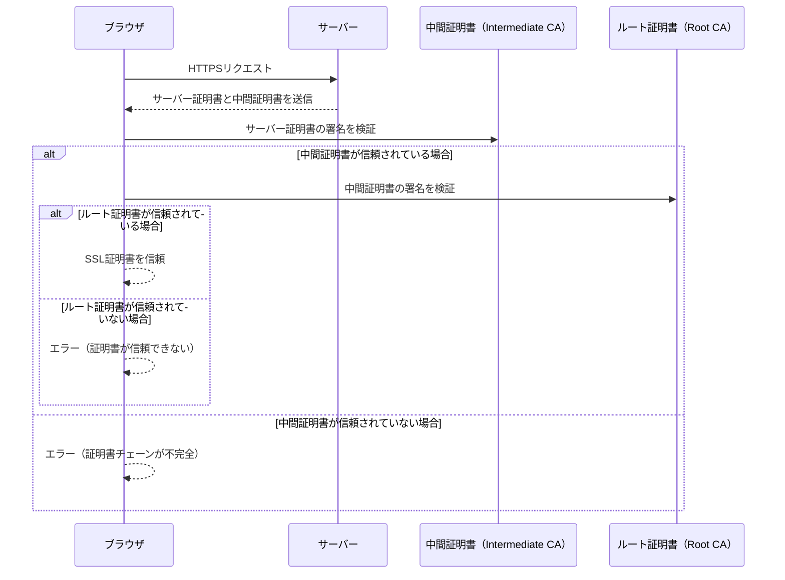
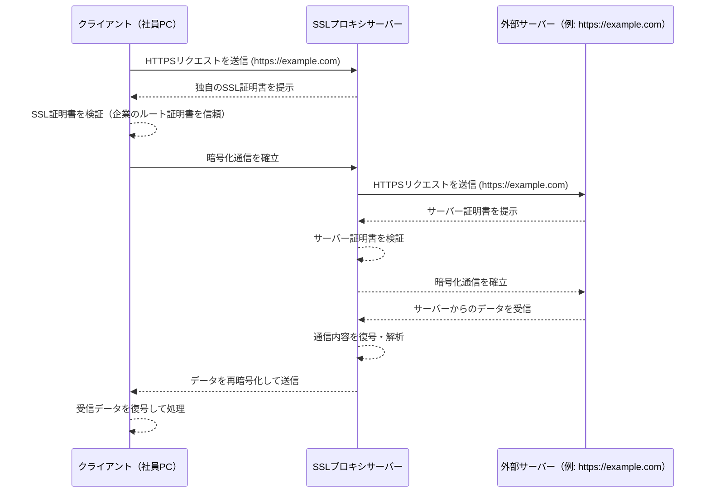
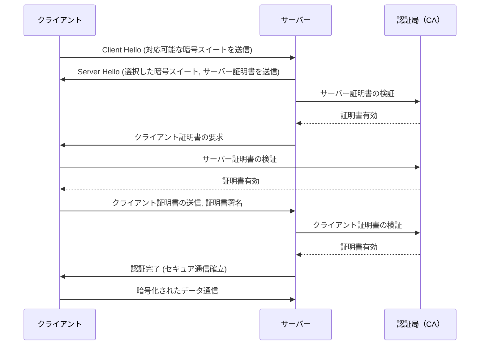

# 登場人物
- ブラウザ
    - クライアント側のWebブラウザ
    - ブラウザにはルート証明書がデフォルトでインストールされている
- サーバー
    - クライアントがアクセスしたいウェブサイト等
    - サーバーがHTTPS通信するためには、サーバーにSSL証明書をインストールする必要がある。/etc/conf.d/sslなどに配置する？
- 中間CA
    - サーバーのSSL証明書の正当性を保証する認証局
    - 例：AWSのACMを使って証明書を発行した場合サーバーと中間CAの間にACMが存在する。中間CAはAWSが管理する認証局となる。
- ルートCA
    - 中間CAの正当性を保証する。全てのCAの親。

# シーケンス

# SSL代理証明
- 企業ネットワークなどで、社員の通信を監視したいニーズが有る。しかしクライアント（社員）とサーバーの通信はSSLで暗号化されているため監視できない。
- クライアントとサーバーの間にプロキシサーバーを割り込ませる
- プロキシサーバーとサーバー間では通常通りのSSL通信を行う
- 企業用の独自のSSL証明書を発行し、クライアントとプロキシ間では独自SSL証明書を使った通信をさせる。クライアントにはあらかじめ独自SSL証明書を配布しインストールさせておく。

# オレオレ証明書
- SSL証明書を自分で作成してサーバーにUPする。ルートCA・中間CAを使わない。
- 公開鍵も秘密鍵も自分で作成する
- 接続時に安全な接続ではないことをブラウザから警告を受ける
- ローカル環境・検証環境でSSLの設定が面倒なときや明らかに不要なときに用いる手段。
- 本番環境での利用はもちろんNG

# TLS相互認証
- サーバー証明書だけでなく、クライアント側の持つクライアント証明書の検証も実施する

# 参考
https://qiita.com/miyuki_samitani/items/b19aa5ac3b3c6e312bd5

https://speakerdeck.com/minorun365/zheng-ming-shu-tutehe-datuke-awsnozhong-jian-cayi-xing-nibei-eru

https://www.cloudflare.com/ja-jp/learning/access-management/what-is-mutual-tls/
