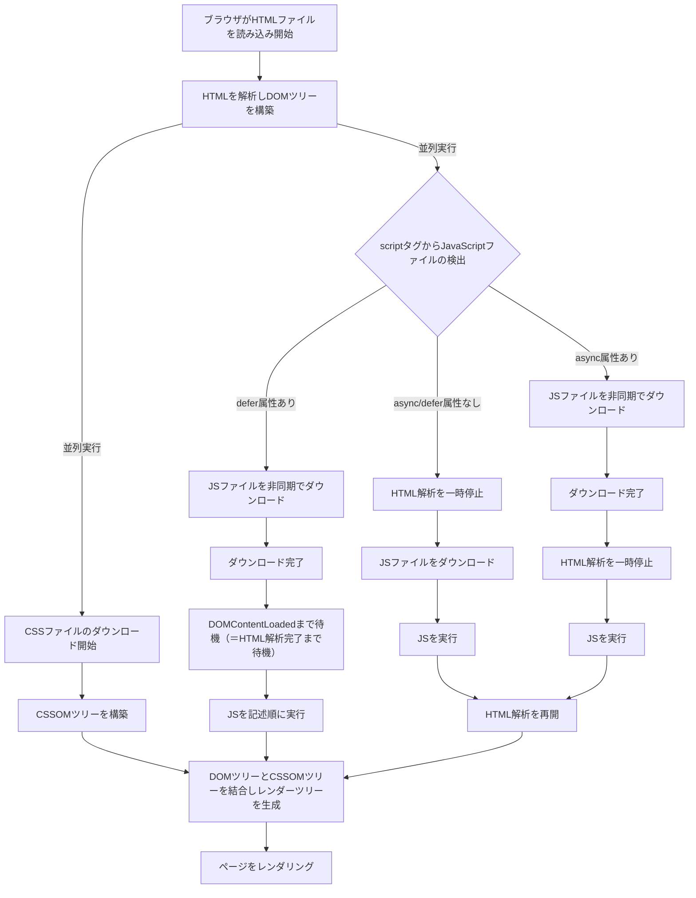

# はじめに
「ブラウザで`https://example.com`が表示されるまでに、どんなことが起こりますか？」

この質問に可能な限り詳細に回答しようと試みたのが本記事となっております。**ただし、あくまで「私が考えた限りでの事象を列挙した」という形になります。** 技術的に間違ったことを記載していたらこっそりご指摘ください。

# TL;DR
本記事では以下の順番でそれぞれの処理を言及していきます。


# L5-L7で行われること
### HTTP
ブラウザに`https://example.com/top`というURLを打ちEnterを押したとします。すると以下のようなHTTPリクエストが生成されます。
```
GET /top HTTP/1.1 Host: example.com
```

このリクエストを後続のレイヤに渡していきます。

### DNS解決
入力されたURLのドメイン部分を用いてDNS名前解決を実行します。

DNSの名前解決における役割分担は3種類の構成要素があります。
1. スタブリゾルバー
    - ブラウザから呼び出されるリゾルバー
    - フルリゾルバーに名前解決の要求を送る。スタブリゾルバ自体は名前解決を実施しない。
2. フルリゾルバー
    - 権威サーバーに問い合わせて名前解決を実行する
    - ルートドメインから順に問い合わせていくことで解決する
    - 解決した結果はDNSキャッシュに保存される
    - 名前解決の結果がキャッシュに残っている場合はキャッシュからスタブリゾルバーに応答を返す
3. 権威サーバー
    - それぞれのドメインのネームサーバー群


名前解決はTLD(Top Level Domain)から順に解決していきます。`https://example.com/top`の場合は`.` -> `com` -> `example`の順番に解決されます。`.`はルートドメインです。


得られたIPアドレスをもとに後続の処理を進めます。

:::note info
hostsファイルが存在する場合はスタブリゾルバによる名前解決処理よりも先にhostsファイルの参照が優先されます。（/etc/hosts, C:\Windows\System32\drivers\etc\hostsなど）
:::

### 暗号化
HTTPS通信の場合はHTTPリクエストの暗号化を実施します。（ClientHello、ServerHello、ServerKeyExchangeなどのやり取りを行います）

# L4 トランスポート層/TCP
ブラウザから送信されたHTTPリクエストはL4でTCPプロトコルが採用されます。HTTP/1.1, HTTP/2はTCPとなります。HTTP/3ではQUICというUDPベースの新たなプロトコルが採用されていますが、ここではその説明は割愛します。

ここで送信データにTCPヘッダが付与され、TCPセグメントとして後続に送信されます。

### コネクション型・コネクションレス型
TCPはコネクション型のプロトコルです。コネクション型とは自分と通信相手の間にコネクションを確立させ、そのコネクションを通して通信をすることです。コネクション型に対してコネクションレス型のプロトコルも存在し、UDPなどはコネクションレス型にあたります。コネクション型の利点は通信相手が存在することを保証するところであり、万一通信相手がいないもしくはなんらかの事情で通信不能な状態である場合に、送信側が事前にそれを知ることができます。

### SYN/ACK
コネクション型のTCPでは通信相手と正しく通信できるかを確認するためにSYN/ACKと呼ばれるフラグを用います。SYN: Synchronize, ACK: Acknowledgeの略です。


このようなやりとりを3-way handshakeといいます。

# L3 ネットワーク層/IP
L3のネットワーク層ではIPプロトコルを用いた通信を行います。L3では複数個のルーターを介して宛先までパケットを届けます。IPプロトコルでは異なるネットワーク間における通信を行います。これに対して、後述するL2のデータリンク層では同一ネットワーク内の機器間の通信を行います。

ここで送信データにIPヘッダが付与され、IPパケット（単にパケットとも呼ぶ）として後続に送信されます。


ルーターに送信されたパケットはルーター内で保持されたルーティングテーブルを用いて次の行き先を決定します。ルーティングテーブルとは以下のように宛先ネットワーク・ネクストホップの情報が格納されたテーブルです。

| 宛先ネットワーク | ネクストホップ |
|:--|:--|
| 192.168.2.0 | Directly Connected |

ルーティングテーブルのレコードの設定方法は2種類あり、static routingとdynamic routingがあります。static routingは手作業で1行ずつレコードを追加していく手法です。dynamic routingはBGPプロトコルなどを用いて動的にレコードを決定します。

# L2 データリンク層/イーサネット
L2のデータリンク層ではイーサネットを用いた通信を行います。具体的には、L3の図で`ネットワーク1 192.168.1.10`として雲のイラストで隠していた部分の詳細の説明となります。ネットワーク1の中にはL2スイッチと呼ばれる機器が存在し、L2スイッチがルーターとホストを繋ぎます。L2スイッチとホストの間はイーサネットケーブルと呼ばれる物理ケーブルで接続されています。（無線LAN環境の場合は、物理的なケーブルではなく電波（無線）によって接続されますが、その場合でも無線LANアクセスポイント（WLAN AP）が実質的にL2スイッチの役割を担い、L2レベルでのフレーム転送を行います。）


L2ではARPを用いて宛先IPアドレスをMACアドレスに変換し、MACアドレスを用いて宛先ホストを特定します。なお、ARPはIPv4で利用されるプロトコルであり、IPv6の場合はNDP(Neighbor Discovery Protocol)が利用されます。また、L2でイーサネットヘッダが付与されます。L2ではパケットのことをイーサネットフレームと呼びます。

# L1 物理層
L2から送信されてきたイーサネットフレームを電気信号に変換して宛先に送信します。L7から出発して各レイヤーで様々なヘッダを付与されてきたイーサネットフレームですが、コンピューターの世界ではデータは最終的には0,1の二進数のbitに落とし込み、その情報は電圧の高低で表現されます。ケーブルの長さによっては電圧が途中で減衰する可能性があるため、リピータなどを使って増幅させます。


# 宛先側のL1からL7へ順番に送信
送信元のブラウザからスタートしてL7,L6, ... L1の順に送信されてきたデータを宛先側のL1で受け取ったら、宛先側でL1,L2, ... L7の順にパケットを受信していきます。各レイヤーで付与したヘッダーを順番に剥がしていきます。


# 宛先ホストからのレスポンスを受信する
宛先側までパケットが届くと、宛先ホストはレスポンスとしてデータを生成し送信元ホストにパケットを送り返します。このパケットも先ほどと同様にL7〜L1の旅を経て送信元ホストに到着します。これが`GET /top HTTP/1.1 Host: example.com`というHTTPリクエストに対するHTTPレスポンスとなります。

# HTML, CSS, JSの読み込み
パケットのやり取りの完了後、ブラウザ側でHTMLの読み込みが始まります。前提として、以下のようなDOMの構成になっているものとします。

:::note info
オーソドックスなDOMの構成を書きました。説明のために細部は一部省略しています。
:::

```html
<html>
  <head>
    <link></link> <!-- load CSS in <head></head> -->
    <title></title>
  </head>
  <body>
    <h1>Heading 1</h1>
    <p>some text</p>
    <script src="..."></script> <!-- load JS before </body> -->
  </body>
</html>
```

### DOMとCSSの読み込み
ブラウザはHTMLファイルに記述されたタグを上から順に読み込んで解析していきDOMツリーを構築していきます。読み込みの途中でlinkタグからCSSファイルを発見した場合、DOMツリーの構築と並行してCSSファイルの読み込みも開始します。つまり、CSSファイルはheadタグ内のなるべく上位の箇所でロードした方が、CSSの読み込みが早くなります。

### JSの読み込み
HTML解析中にscriptタグから外部JSファイルを発見した場合、基本的にはHTMLの解析を中断しJSのロードと実行を開始します。まだ解析されていないDOMに対してJSから操作を行うとエラーが発生する恐れがあるため、JSファイルは`</body>`の直前に記述することが推奨されています。

ただし、これはscriptタグにasync属性もしくはdefer属性が指定されていない場合の挙動です。async属性・defer属性がある場合の挙動は以下のとおりです。
- async属性
  1. scriptタグからJSファイルを発見
  2. HTMLの解析と並行してJSファイルのダウンロードを開始
  3. JSのダウンロードが完了したらHTMLの解析を中断しJSの実行を開始
  4. JS実行終了後にHTMLの解析を再開
- defer属性
  1. scriptタグからJSファイルを発見
  2. HTMLの解析と並行してJSファイルのダウンロードを開始
  3. JSのダウンロード完了
  4. DOMContentLoadedまで待機（＝HTML解析完了まで待機）
  5. JSの実行を開始

フローにまとめると以下の通りです。


# ついに！
ブラウザに`https://example.com/top`が表示されました。お疲れ様でした。
