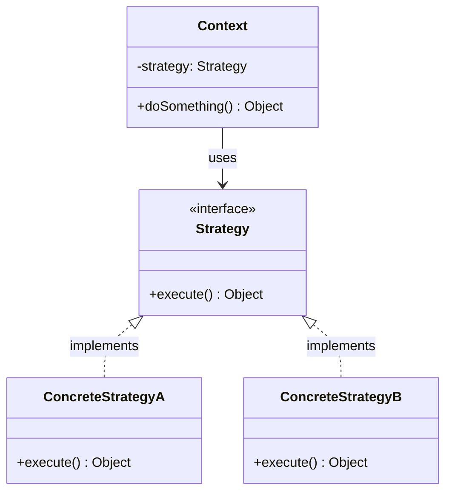
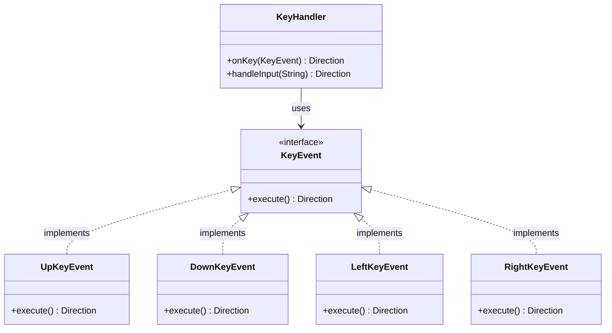

# SOLID原則のO
SOLID原則とはシステム設計に関する原則を5つ定め、その頭文字をとってSOLIDと称しているものです。

- S: SRP - 単一責任の原則
- O: OCP - オープン・クローズドの原則
- L: LSP - リスコフの置換原則
- I: ISP - インターフェース分離の原則
- D: DIP - 依存関係逆転の原則

オープン・クローズドの原則とは、拡張に開いて修正に閉じる、という設計思想です。この文言だけ聞いてもよくわかりませんよね。Clean Arichtectureという本でSOLID原則とはなんぞやというところを自分は学んだのですが、どうも座学だけではいまいちピンときてない状態で、ふんわりした理解のままいました。

# 具体例で腹落ちした
いつも聴いているリファラジというPodcastでOCPに関するエピソードがありました。

https://podcasts.apple.com/us/podcast/103-%E9%96%8B%E6%94%BE%E9%96%89%E9%8E%96%E5%8E%9F%E5%89%87-solid%E3%81%AEo-%E6%8B%A1%E5%BC%B5%E3%81%AB%E9%96%8B%E3%81%8D-%E4%BF%AE%E6%AD%A3%E3%81%AB%E9%96%89%E3%81%98%E3%82%8B-%E3%81%A3%E3%81%A6%E4%BD%95/id1721989211?i=1000739203916

Podcastでは、OCPってSOLIDの中でもちょっと難解な概念だよね〜という導入から始まり、「拡張に開いて修正に閉じる」という概念を具体例を交えて丁寧に説明されていました。これをきいて、自分の中でずっとふんわりとしていたOCPに対する理解がようやく腹落ちした気がしました。

Podcastでは上下左右の矢印キーの入力に応じてそれぞれ挙動を返す関数を例にとっていました。私の解釈をソースコードに起こしてみます。

＜仕様＞
- 関数は↓↑の矢印キーをインプットとして受け取り、方向に応じた挙動を返却する(最初の仕様ではインプットは上下のみ。後の仕様変更で左右のインプットが要求される予定。)

＜ダメな実装＞
OCPに反した実装例です。

```java
enum Direction {
    UP, DOWN, UNDEFINED
}

public Direction onKey(String input) {
    return switch(input) {
        case "↓":
            yield Direction.DOWN;
        case "↑":
            yield Direction.UP;
        default:
            yield Direction.UNDEFINED;
    };
}

public Direction handleInput(String input) {
    return onKey(input);
}
```
この実装は仕様を満たします。が、追加仕様で左右の矢印キーを追加する必要がでてきた時に、以下のように既存のコードを修正する必要があります。

```java
enum Direction {
    UP, DOWN, LEFT, RIGHT, UNDEFINED // enum modified
}

public Direction onKey(String input) {
    return switch(input) {
        case "←":
            yield Direction.LEFT; // case added
        case "↓":
            yield Direction.DOWN;
        case "↑":
            yield Direction.UP;
        case "→":
            yield Direction.RIGHT; // case added
        default:
            yield Direction.UNDEFINED;
    };
}

public Direction handleInput(String input) {
    return onKey(input);
}
```

問題点：
1. `Direction` enumに新しい値を追加する必要がある
2. `onKey`メソッドのswitch文に新しいcaseを追加する必要がある
3. つまり、既存のコードを修正している

これは「修正に閉じていない」状態です。新しい機能を追加するたびに、既存のコードを変更する必要があり、以下のリスクがあります：
- 既存機能にバグを混入させる可能性
- テスト済みのコードを再テストする必要

＜良い実装＞
次に、良い実装例です。
```java
// Direction enum for type safety
enum Direction {
    UP, DOWN, LEFT, RIGHT, UNDEFINED
}

interface KeyEvent {
    Direction execute();
}

class UpKeyEvent implements KeyEvent {
    @Override
    public Direction execute() {
        return Direction.UP;
    }
}

class DownKeyEvent implements KeyEvent {
    @Override
    public Direction execute() {
        return Direction.DOWN;
    }
}

class LeftKeyEvent implements KeyEvent {
    @Override
    public Direction execute() {
        return Direction.LEFT;
    }
}

class RightKeyEvent implements KeyEvent {
    @Override
    public Direction execute() {
        return Direction.RIGHT;
    }
}

class UndefinedKeyEvent implements KeyEvent {
    @Override
    public Direction execute() {
        return Direction.UNDEFINED;
    }
}

class KeyEventFactory {
    private static final Map<String, KeyEvent> KEY_EVENT_MAP = Map.of(
        "↑", new UpKeyEvent(),
        "↓", new DownKeyEvent(),
        "←", new LeftKeyEvent(),
        "→", new RightKeyEvent()
    );

    public static KeyEvent create(String input) {
        return KEY_EVENT_MAP.getOrDefault(input, new UndefinedKeyEvent());
    }
}

// Main handler - CLOSED for modification
public Direction onKey(KeyEvent event) {
    return event.execute();
}

// Usage example
public Direction handleInput(String input) {
    final KeyEvent event = KeyEventFactory.create(input);
    return onKey(event);
}
```

この実装では以下の点が改善されています：

- 修正に閉じている: `onKey`メソッドは新しいキーが追加されても変更不要です。
- 拡張に開いている: 新しいキーを追加する場合は、新しい`KeyEvent`実装クラスを作成し、`KeyEventFactory`の`Map`に追加するだけです。

例えば、斜め方向のキー（右上など）を追加したい場合：

```java
// Add new direction to enum
enum Direction {
    UP, DOWN, LEFT, RIGHT, UP_RIGHT, UNDEFINED
}

// Add new strategy implementation
class UpRightKeyEvent implements KeyEvent {
    @Override
    public Direction execute() {
        return Direction.UP_RIGHT;
    }
}

// Update factory (this is the only existing code that needs modification)
class KeyEventFactory {
    private static final Map<String, KeyEvent> KEY_EVENT_MAP = Map.of(
        "↑", new UpKeyEvent(),
        "↓", new DownKeyEvent(),
        "←", new LeftKeyEvent(),
        "→", new RightKeyEvent(),
        "↗", new UpRightKeyEvent() // Add new mapping
    );

    public static KeyEvent create(String input) {
        return KEY_EVENT_MAP.getOrDefault(input, new UndefinedKeyEvent());
    }
}
```

重要なのは、`onKey`メソッド自体は一切修正する必要がないという点です。新しい機能を追加する際に既存のコードを変更しなくて済むため、バグを混入させるリスクが低くなります。

# Strategyパターン

この「良い実装」は、デザインパターンの一つであるStrategyパターンを使用しています。Strategyパターンとは、アルゴリズムをオブジェクトとしてカプセル化し、実行時に切り替え可能にするデザインパターンです。

## 一般的なStrategyパターンの構造



Strategyパターンは以下の要素で構成されます：
- **Strategy（戦略）**: アルゴリズムの共通インターフェース
- **ConcreteStrategy（具体的な戦略）**: Strategyインターフェースを実装した具体的なアルゴリズム
- **Context（コンテキスト）**: Strategyを使用する側のクラス

## 今回のOCP例におけるStrategyパターン


※Strategyパターンの説明に注目するためにKeyEventFactory, Directionは割愛

今回の例では：
- `KeyEvent`インターフェースが**Strategy（戦略の抽象）**
- `UpKeyEvent`、`DownKeyEvent`などが**具体的なStrategy実装（各戦略）**
- `onKey`メソッドを持つ`KeyHandler`が**Context（戦略を使う側）**

の役割を果たしています。

新しいキー操作を追加する際は、新しいStrategyクラス（`KeyEvent`の実装）を追加し、`KeyEventFactory`のマッピングを更新するだけで済みます。`onKey`メソッドという既存のコアロジックを修正する必要がありません。

これがまさに「拡張に開いて、修正に閉じる」というOCPの原則を体現しています。

## OCPの本質

OCPの本質は、「ソフトウェアの振る舞いを変更するときに、既存のコードを変更せずに新しいコードを追加することで実現する」という点にあります。


ただし、すべてのコードをOCPに準拠させる必要はありません。変更が頻繁に発生する部分、将来的な拡張が予想される部分に対して適用することで、保守性の高い設計を実現できます。
