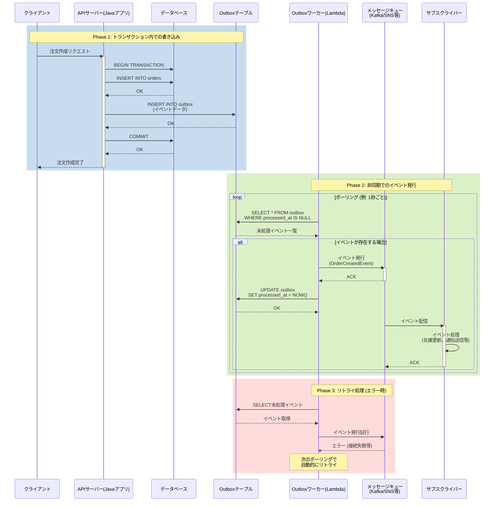

Outboxパターンは、分散システムにおけるデータベース操作とメッセージング（イベント発行）の整合性を保証するための設計パターンです。

# 課題
例えば以下のようなJavaアプリの処理があったとします。
```java
@Transactional
public void createOrder(Order order) {
    orderRepository.save(order);  // DBに保存
    eventPublisher.publish(new OrderCreatedEvent(order));  // イベント発行
}
```

この実装の問題点は、DBトランザクションorイベント発行のどちらかが失敗した場合にデータの整合性が取れなくなる恐れがある点です。

- DB成功・イベント失敗
    - DBにはデータがあるが、イベントは失敗しているので期待する状態になっていない
- DB失敗・イベント成功
    - `@Transactional`アノテーションによりDBトランザクションはロールバックされるが、イベント発行処理はロールバックされない。
    - DBにデータがないが、イベント側は処理が走ってしまう。

# Outboxパターンによる解決法
Outboxテーブルという新しいテーブルを同じDBに作成します。そして先ほどの処理を以下のように修正します。
```sql
CREATE TABLE outbox (
    id UUID PRIMARY KEY,
    event_type VARCHAR,
    payload JSONB,
    status VARCHAR,
    created_at TIMESTAMP,
    processed_at TIMESTAMP
);
```

```java
@Transactional
public void createOrder(Order order, Event event) {
    orderRepository.save(order); // アプリで持つ
    outboxRepository.save(event); // イベントを保存
}
```

アプリケーション側の処理はこれで終了です。
イベント発行処理は別のプロセスに委譲します。

例えばAWS Lambdaなどで、Outboxテーブルをポーリングしてイベント発行する処理を書きます。
```py
def process_outbox(self):
"""未処理イベントを取得して発行"""
    events = self.outbox_repository.find_unprocessed()
    
    for event in events:
        try:
            # イベント発行
            self.event_publisher.publish(event)
            # Outboxテーブルを更新
            self.outbox_repository.mark_as_processed(event.id)
            logger.info(f"Processed event: {event.id}")
        except Exception as e:
            logger.error(f"Failed to process event {event.id}: {e}")
```
このLambdaをEventbridgeなどで定期実行することでOutboxテーブルをポーリングすることができます。


以上の流れをシーケンス図に起こします。



# Outboxパターンのポイント
- イベント発行処理をワーカー側(Lambda)に委譲できる
    - Javaアプリ側はOutboxテーブルへのINSERTまで担保できていればOK。単純に2つのテーブルへのコミットを1つのトランザクションで行うだけなので、特に複雑な実装は不要。
    - イベントの発行自体はワーカーが責任を持つ
    - 上限回数までリトライしてもイベントに失敗する場合は、別途そのことを通知する仕組みをワーカー側もしくはCloudWatchなどのアラートで通知する必要がある。
- イベントは非同期処理で行う前提
    - イベントが正常終了した後に別の処理を行う、といった要件がある場合はOutboxパターンは適していない。
    - その場合は同期処理を使った別の実装が必要

# 参考

https://docs.aws.amazon.com/ja_jp/prescriptive-guidance/latest/cloud-design-patterns/transactional-outbox.html

https://miraitranslate-tech.hatenablog.jp/entry/2022/09/20/120000

